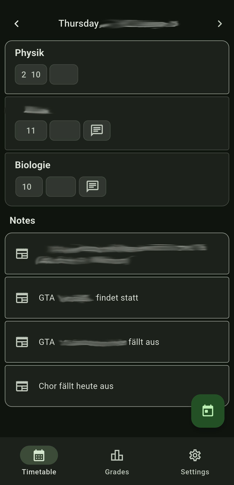
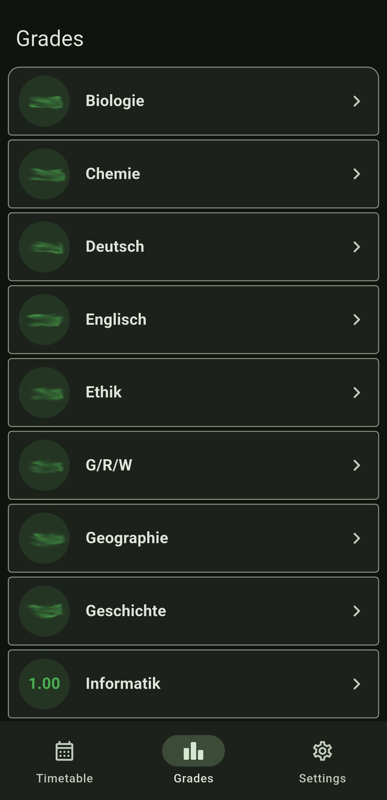
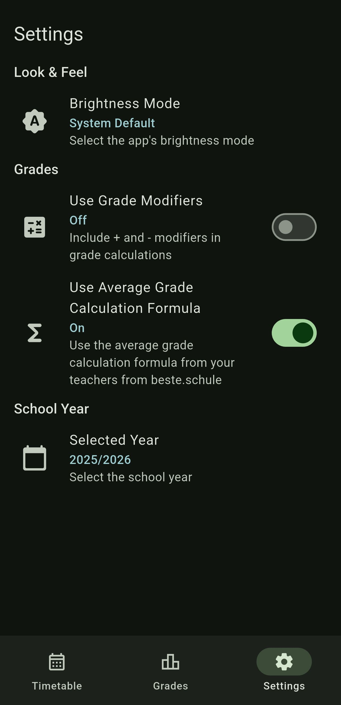

<h1 align="center">🏫 BetterSchool 🏫</h1>

<div align="center">
  
  
  
  
  
</div>

<div align="center"><b>Free of charge, Ad-Free and Open Source forever</b></div>  
<p align="center">BetterSchool is an unofficial, feature-rich client for <a href="https://beste.schule">beste.schule</a>, designed for students and parents.</p>
<p align="center">The app is designed to give students and their parents a clean and simple way to access their data like timetable and grades from beste.schule.</p>
 
<p align="center"><i>No ads, no tracking, no subscriptions — just a clean, privacy-focused experience.</i></p>

> [!IMPORTANT]
> BetterSchool is not an official beste.schule client and not affiliated with beste.schule.

---

## 🔗 Quick Links

- [Download Latest Release](https://github.com/unixkiwi/betterschool/releases)
- [Report an Issue](https://github.com/unixkiwi/betterschool/issues)
- [beste.schule Official Website](https://beste.schule)

---

## ✨ Features

### 📅 Timetable

- View your timetable from beste.schule
- **Cancelled lessons** are **highlighted**, so you're the first to see the cancellation
- Intuitive navigation between days and weeks

### 📊 Grades & Insights

- **Full grade overview** per subject, with date, title and type
- **Smart analytics and interactive charts**:
  - Average grade per subject
  - Average of all grades

### 🚧 Coming Soon

- [ ] **Advanced analytics** such as grade trends within subjects and over years
- [ ] **To-Do List & Task Manager** (assignments, exams, deadlines).

---

## 📱 Screenshots
| Timetable | Grades | Settings |
|-----------|--------|----------|
|  |  | 


## ⚙️ Installation

### 📲 Direct Download

> [!TIP]
> A first release is already available!

[](https://github.com/unixkiwi/betterschool/releases) 
[](https://apps.obtainium.imranr.dev/redirect.html?r=obtainium://add/https://github.com/unixkiwi/betterschool)

You will probably want the **arm64-v8a** version if you have a normal android device, if the version doesn't work try the armabi-v7a version. 

### 🛠️ Build from Source

### Prerequisites

- Flutter
- Android device or emulator

1. Clone the repo:

```bash
git clone https://github.com/unixkiwi/betterschool
cd schoolapp
```

2. Install dependencies:

```bash
flutter pub get
```

3. Run the app:

```bash
flutter run            # for debug
flutter run --release  # for release (more performance)
```

4. Build for Production (optional)

```bash
flutter build apk --release --split-per-abi  # Android
```

---

## 🤝 Contributing

Contributions are welcome! Here’s how:

1. **Fork** the repository.
2. Create a branch: `git checkout -b feature/your-idea`.
3. Commit changes: `git commit -m 'Add amazing feature'`.
4. Push: `git push origin feature/your-idea`.
5. Open a **pull request**.

Check the [Issues](https://github.com/unixkiwi/betterschool/issues) for bugs/feature requests.

---

## 📜 License

This project is licensed under the [AGPL - GNU Affero General Public License](https://github.com/unixkiwi/betterschool/blob/master/LICENSE), which ensures that this projects stays FOSS.

---

## 🙏 Credits

- All illustrations in this project come from [undraw](https://undraw.co). They provide a carefully created collection of simple and beautiful open-source SVG illustrations.

---

> ✨ **Open Source** · 🔒 **Ad-Free Forever** · 🚀 **By Students, For Students**
